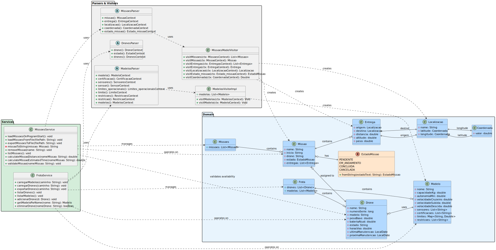

# Trabalho de LPROG (LPROG_ACS_2DI_1212125_1221515)

Trabalho individual de LPROG - 2º Semestre 2024/2025 da turma 2DI. 
LPROG_ACS_2DI_1212125_1221515, desenvolvido por:

- Ricardo Guimarães 1212125
- Carlos Almeida 1221515

## Regras das gramaticas
As gramaticas sao definidas em ANTLR4, e estão localizadas na pasta src.
A estrutura de cada gramatica é simples e funciona similar a JSON, mas sem virgulas entre os elementos.


### [1. Modelos](docs/gramaticas/Modelos.g4)

| Regra                  | Descrição                                                                                                                                                                                                                                                                                                                               |
|------------------------|-----------------------------------------------------------------------------------------------------------------------------------------------------------------------------------------------------------------------------------------------------------------------------------------------------------------------------------------|
| `modelos`              | Define a estrutura geral de um conjunto de modelos. Pode consistir em zero ou mais definições de `modelo`, seguidas por um marcador de Fim De Ficheiro (EOF).                                                                                                                                                                           |
| `modelo`               | Descreve o projeto ou tipo de um drone. Começa com a palavra-chave 'modelo', seguida por um nome de modelo (STRING). Em seguida, contém detalhes entre chavetas: capacidade em kg, autonomia em minutos, especificações de velocidade (cruzeiro, subida, descida), lista de sensores, certificações, limites operacionais e restrições. |
| `capacidade`           | (Dentro de `modelo`) Especifica a capacidade de carga do modelo de drone em quilogramas, representada por um valor `NUM` seguido de "kg".                                                                                                                                                                                               |
| `autonomia`            | (Dentro de `modelo`) Especifica a autonomia de voo do modelo de drone em minutos, representada por um valor `NUM` seguido de "min".                                                                                                                                                                                                     |
| `velocidade`           | (Dentro de `modelo`) Define as especificações de velocidade do modelo entre chavetas, contendo três tipos de velocidade: cruzeiro, subida e descida, cada uma em km/h.                                                                                                                                                                  |
| `certificacao`         | Representa uma certificação específica que o modelo de drone possui. É um `ID` (identificador).                                                                                                                                                                                                                                         |
| `sensores`             | Define uma lista de sensores. Consiste em um ou mais identificadores de `sensor`, separados por vírgulas.                                                                                                                                                                                                                               |
| `sensor`               | Representa um único sensor. É um `ID` (identificador).                                                                                                                                                                                                                                                                                  |
| `limites_operacionais` | Define uma lista de limites operacionais para um modelo de drone. Consiste em uma ou mais definições de `limite`, separadas por vírgulas.                                                                                                                                                                                               |
| `limite`               | Especifica um único tipo de limite operacional. Pode ser `max_horas_voo`, `max_altitude`, `min_bateria` ou `max_peso`, cada um seguido por um valor `NUM`.                                                                                                                                                                              |
| `restricoes`           | Define uma lista de restrições operacionais para um modelo de drone. Consiste em uma ou mais definições de `restricao`, separadas por vírgulas.                                                                                                                                                                                         |
| `restricao`            | Especifica uma única restrição operacional. Pode ser 'voo_diurno' ou 'voo_noturno'.                                                                                                                                                                                                                                                     |

### [2. Drones](docs/gramaticas/Drones.g4)

| Regra                | Descrição                                                                                                                                                                                                                                                                                                                    |
|----------------------|------------------------------------------------------------------------------------------------------------------------------------------------------------------------------------------------------------------------------------------------------------------------------------------------------------------------------|
| `drones`             | Define a estrutura geral de um conjunto de drones. Pode consistir em zero ou mais definições de `drone`, seguidas por um marcador de Fim De Ficheiro (EOF).                                                                                                                                                                  |
| `drone`              | Representa uma instância individual de drone. Começa com a palavra-chave 'drone', seguida por um identificador único para o drone (STRING). Entre chavetas estão o número de série, o modelo de referência, peso base em kg, bateria atual em %, estado atual, horas de voo, data da última manutenção e próxima manutenção. |
| `numero_serie`       | (Dentro de `drone`) Especifica o número de série único do drone, representado por um valor `NUM`.                                                                                                                                                                                                                            |
| `modelo`             | (Dentro de `drone`) Especifica o modelo de referência do drone, representado por um valor `STRING` que deve corresponder a um modelo definido na gramática Modelos.                                                                                                                                                          |
| `peso_base`          | (Dentro de `drone`) Especifica o peso base do drone em quilogramas, representado por um valor `NUM` seguido de "kg".                                                                                                                                                                                                         |
| `bateria_atual`      | (Dentro de `drone`) Especifica o nível atual de bateria do drone em percentagem, representado por um valor `NUM` seguido de "%".                                                                                                                                                                                             |
| `horas_voo`          | (Dentro de `drone`) Especifica o total de horas de voo acumuladas pelo drone, representado por um valor `NUM`.                                                                                                                                                                                                               |
| `ultima_manutencao`  | (Dentro de `drone`) Especifica a data da última manutenção realizada no drone, representada por um valor `DATA` no formato YYYY-MM-DD.                                                                                                                                                                                       |
| `proxima_manutencao` | (Dentro de `drone`) Especifica a data agendada para a próxima manutenção do drone, representada por um valor `DATA` no formato YYYY-MM-DD.                                                                                                                                                                                   |
| `estado`             | Representa o estado atual de um drone. Pode ser um dos estados predefinidos: 'ativo', 'manutencao', 'inativo', ou 'em_missao'.                                                                                                                                                                                               |

### [3. Missão](docs/gramaticas/Missoes.g4)

| Regra           | Descrição                                                                                                                                                                                                                                                                                                             |
|-----------------|-----------------------------------------------------------------------------------------------------------------------------------------------------------------------------------------------------------------------------------------------------------------------------------------------------------------------|
| `missoes`       | Define a estrutura geral de um conjunto de missões. Pode consistir em zero ou mais definições de `missao`, seguidas por um marcador de Fim De Ficheiro (EOF).                                                                                                                                                         |
| `missao`        | Descreve uma missão individual. Começa com a palavra-chave 'missao', seguida por um nome para a missão (STRING). Em seguida, contém detalhes entre chavetas: a hora de início (`inicio`), o drone designado (`drone`), o estado atual da missão (`estado_missao`), e a rota da missão, que é uma lista de `entregas`. |
| `entregas`      | Define uma lista de entregas para uma missão. Consiste em uma ou mais definições de `entrega`, separadas por vírgulas.                                                                                                                                                                                                |
| `entrega`       | Representa uma única entrega dentro de uma missão. É definida entre chavetas e agrupa os seguintes elementos: `origem`, `destino`, `distancia`, `altitude` e `peso`.                                                                                                                                                  |
| `origem`        | (Dentro de `entrega`) Especifica o local de partida da entrega, representado por uma `localizacao`.                                                                                                                                                                                                                   |
| `destino`       | (Dentro de `entrega`) Especifica o local de chegada da entrega, representado por uma `localizacao`.                                                                                                                                                                                                                   |
| `localizacao`   | Define um local geográfico. É definida entre chavetas e agrupa os elementos `latitude`, `longitude` e `nome`.                                                                                                                                                                                                         |
| `latitude`      | (Dentro de `localizacao`) Especifica a coordenada de latitude do local, representada por uma `coordenada`.                                                                                                                                                                                                            |
| `longitude`     | (Dentro de `localizacao`) Especifica a coordenada de longitude do local, representada por uma `coordenada`.                                                                                                                                                                                                           |
| `coordenada`    | Representa um valor numérico que pode ser positivo (usando apenas `NUM`) ou negativo (usando o símbolo `-` seguido de `NUM`).                                                                                                                                                                                         |
| `nome`          | (Dentro de `localizacao`) Especifica o nome textual do local, representado por um valor STRING.                                                                                                                                                                                                                       |
| `distancia`     | (Dentro de `entrega`) Especifica a distância do percurso da entrega, representada por um NUM seguido de "km".                                                                                                                                                                                                         |
| `altitude`      | (Dentro de `entrega`) Especifica a altitude de voo para o percurso da entrega, representada por um NUM seguido de "m".                                                                                                                                                                                                |
| `peso`          | (Dentro de `entrega`) Especifica o peso da carga a ser entregue, representado por um NUM seguido de "kg".                                                                                                                                                                                                             |
| `estado_missao` | Representa o estado atual de uma missão. Pode ser um dos estados predefinidos: 'planeada', 'em_curso', ou 'concluida'.                                                                                                                                                                                                |

# Tokens
Estes tokens sao comuns às três gramaticas existentes ([Modelos](docs/gramaticas/Modelos.g4), [Drones](docs/gramaticas/Drones.g4) e [Missões](src/main/antlr4/Missoes.g4)). 
Um token define uma cadeia de caracteres representado pela expressão regular definida.
A tabela abaixo descreve os tokens utilizados nas gramáticas.

| **Tokens** | **Descrição**                                                                                                                                     |
|------------|---------------------------------------------------------------------------------------------------------------------------------------------------|
| `STRING`   | Uma sequência de caracteres entre aspas duplas. Não pode conter carriage returns (\r) ou novas linhas (\n).                                       |
| `ID`       | Um identificador, que deve começar com uma letra (a-z, A-Z) ou um underscore (_), seguido por zero ou mais letras, números (0-9), ou underscores. |
| `NUM`      | Um valor numérico. Pode ser um inteiro ou um número decimal (ex: 10, 3.14).                                                                       |
| `HORA`     | Representa uma hora no formato HH:MM (e.g., 09:30, 22:15).                                                                                        |
| `DATA`     | Uma data no formato YYYY-MM-DD (ex: 2023-10-27). Usado especificamente na gramática Drones.                                                       |
| `WS`       | Caracteres de espaço em branco (espaços, tabulações \t, carriage returns \r, novas linhas \n).                                                    |

# Estrutura do projeto

```
LPROG_ACS_2DI_1212125_1221515/
├── README.md                       # Documentação do projeto
├── docs/                           # Documentação e recursos
│   ├── dm.puml                     # Source do modelo de domínio em PlantUML
│   ├── dm.svg                      # Imagem do modelo de dominio em SVG
│   └── gramaticas/                 # Definições das gramáticas ANTLR4
│       ├── Drones.g4               # Gramática para definição de drones
│       ├── Frota.g4                # Gramática antiga da frota (não utilizada)
│       ├── Missoes.g4              # Gramática para definição de missões
│       └── Modelos.g4              # Gramática para definição de modelos
├── src/                            # Source code do projeto
│   └── main/
│       └── java/                   # Código da aplicação em Java 
```


# Modelo de domínio
